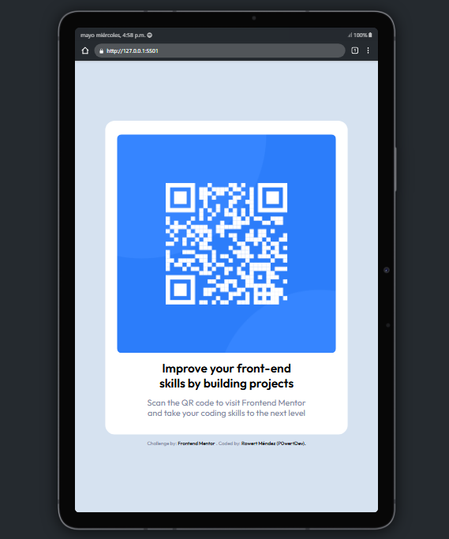

# QR Code Component - Frontend Mentor

## Table of contents

- [QR Code Component - Frontend Mentor](#qr-code-component---frontend-mentor)
  - [Table of contents](#table-of-contents)
  - [Overview](#overview)
    - [Screenshots](#screenshots)
  - [My process](#my-process)
    - [Built with](#built-with)
    - [What I learned](#what-i-learned)
    - [Continued development](#continued-development)
  - [Author](#author)

## Overview

Hi, there! 👋🏽

Very thank you for checking out my solution to the 
[QR Code Component](https://www.frontendmentor.io/challenges/qr-code-component-iux_sIO_H) from Frontend Mentor. 😀

This is my first publication as a newbie developer 😅 

I hope you like and feel free to look around and explore! 😊

### Screenshots

**Desktop**

 

**In mobile**

 

**In tablet**

 

**In landscape**

## My process

### Built with

- Semantic HTML5 markup
- CSS custom properties
- Mobile-first workflow
- Responsive design

### What I learned

I'm still learning the basic semantic structures with HTML5 and CSS properties, especially the responsive design 

### Continued development

* Semantic structures with HTML5
* I need more practice with CSS Flex, and i would like to learn CSS Grid for future projects
* Responsive design

## Author

- GitHub - [P0wertDev](https://github.com/P0wertDev)
- Frontend Mentor - [@P0wertDev](https://www.frontendmentor.io/profile/P0wertDev)
- Twitter - [@P0wertDev](https://x.com/P0wertDev)
